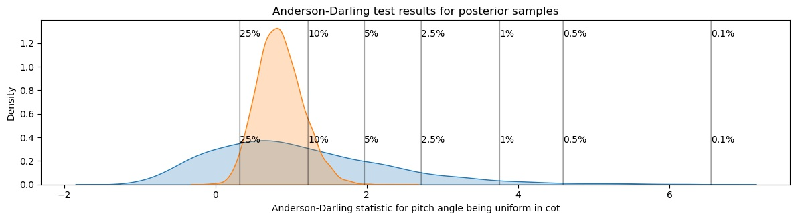

# Galaxy Zoo Builder: Morphological Dependence of Spiral Galaxy Pitch Angle

This repository provides supporting code and data for the paper *"Galaxy Zoo Builder: Morphological Dependence of Spiral Galaxy Pitch Angle"*.

## Motivation

Exploiting the results of the *Galaxy Builder* project ([Lingard et al. 2020]((https://ui.adsabs.harvard.edu/abs/2020arXiv200610450L/abstract))), this work uses hand-drawn annotations from citizen scientists to measure the pitch angles of arms in spiral galaxies.

We wish to use these measurements to examine the links between pitch angle and morphology, and test the simple model of spiral winding proposed by [Pringle and Dobbs (2019)](https://ui.adsabs.harvard.edu/abs/2019MNRAS.490.1470P/abstract).

## Intro to Galaxy Builder
Volunteers were presented with an image of a spiral galaxy, selected using redshift and morphology obtained through Galaxy Zoo 2. The full sample selection is detailed in Hart et al. (2017), but only a subset of these galaxies were classified in *Galaxy Builder*, prioritising low-redshift well-resolved images. The resulting distribution of galaxy stellar mass is therefore not truly representative of the population:

.

Volunteers worked through the modelling of a galaxy in stages (disc, bulge, bar and then spiral arms), with spirals being drawn using any number of freehand poly-lines:

.

Resulting in a dataset of 30 "models" for each galaxy, which can then be aggregated using unsupervised clustering techniques.

Spiral arms were identified, outlying points and points in the centre of the galaxy removed, and the output "Arm" objects have been saved **ADD file path**. The data analysis and reduction was performed using the python package `gzbuilder_analysis`, available on GitHub at [tingard/gzbuilder_analysis](https://github.com/tingard/gzbuilder_analysis).

## Methodology
Early examination of the data suggested it was often the case that different arms in a single galaxy had dramatically different pitch angles.

However, most analysis of spiral pitch angle (and theories associated with spiral formation and evolution), do not make specific predictions for arm pitch angles, instead often quoting a single value for the "pitch angle of a galaxy". For this reason, a hierarchical view of galaxy pitch angle was adopted, where the pitch angle along an individual arm ($\phi_\mathrm{arm}$) was assumed to be constant (a logarithmic spiral), but arms in a galaxy were allowed to vary around some group mean ($\phi_\mathrm{gal}$), distributed Normally (and truncated to being between 0˚ and 90˚) with some spread common to all galaxies in the sample ($\sigma_\mathrm{gal}$). The motivation behind assuming a common $\sigma_\mathrm{gal}$ was purely due to the limited sample size and low number of arms measured per galaxy.

For full details of the hierarchical model, please refer to the paper (or if you can read PyMC check out the `UniformBHSM` class in `hierarchial_model.py` - and please provide feedback to help make the code more readable!

## Results

Our model outputs predictions for all spiral parameters, including arm position, the spiral arm pitch angles, and associated galaxy pitch angles:

We make use of these results to examine how spiral properties vary with galaxy morphology (determined using Galaxy Zoo 2 morphologies), and test a simple model of spiral winding.

To summarise: we do not find evidence that the presence or strength of a bar impacts spiral arm tightness, and do not find evidence to discount the model of spiral winding proposed by [Pringle & Dobbs (2019)](https://arxiv.org/pdf/1909.10291.pdf) (given limits of $15
< \phi < 50$). For further detail, please see the upcoming paper!

### Morphology

Testing both galaxy and individual arm pitch angle vs morphology (we cannot reject the null hypothesis at the 1% level for any of our samples):

### Spiral winding

We want to investigate whether spirals are static, rotating as rigid bodies,

whether their arms wind, dissapate and reform together,

or whether each arm is formed, winds up and dissapates independently:

Testing both galaxy and individual spiral winding (we cannot reject the null hypothesis at the 1% level for any of our samples):

